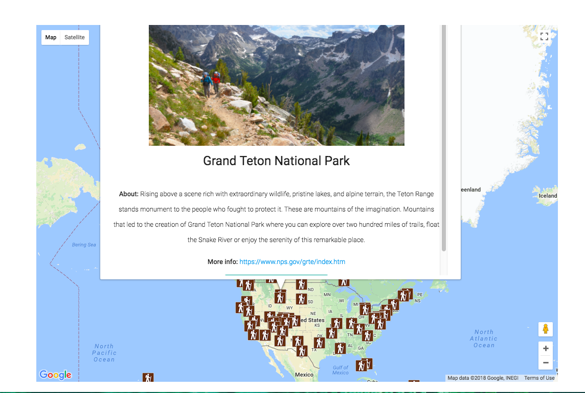

# National Park Finder

[National Park Finder](http://park-finder.surge.sh/) allows users to interactively explore National Parks within the US and add them to a 'favorites' list. To discover areas, a user can click on the map pins to read about the area, add the park to their favorites list, or navigate to the corresponding National Park Service website. Data is rendered from both the Google Maps API and National Park Finder APi.

User can browse around the interactive Google Map to find National Parks within the US. By clicking on a pin, the user can find out park information, view a a photo, and add the park to their favorites list.

User can view their favorite parks. To remove the park from their list, user can click the 'remove' button.

## Technologies

* JavaScript
* jQuery
* HTML
* CSS
* Materialize
* Mocha
* Chai
* API's: National Park Service v1, Google Maps.
