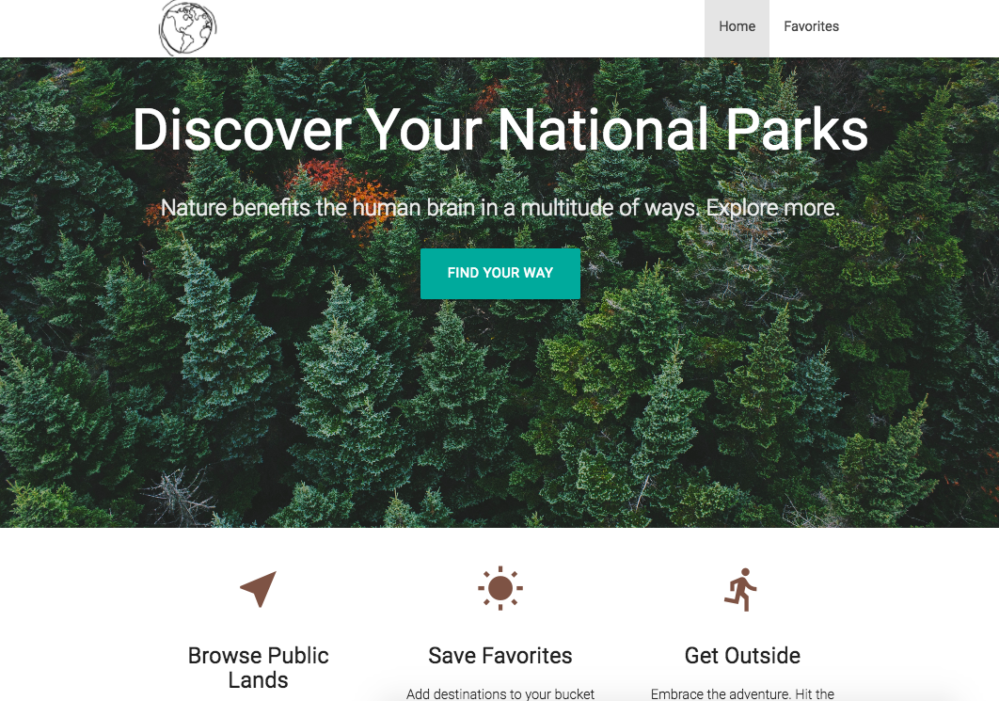
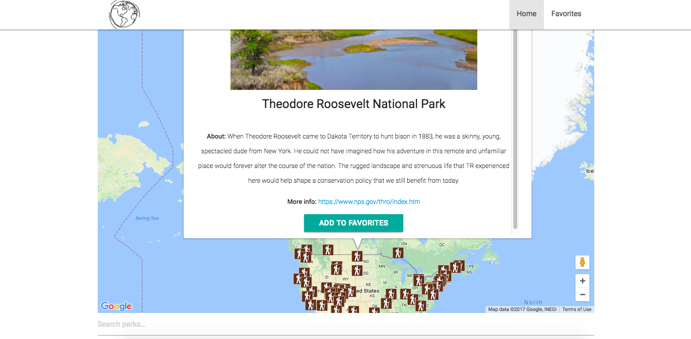
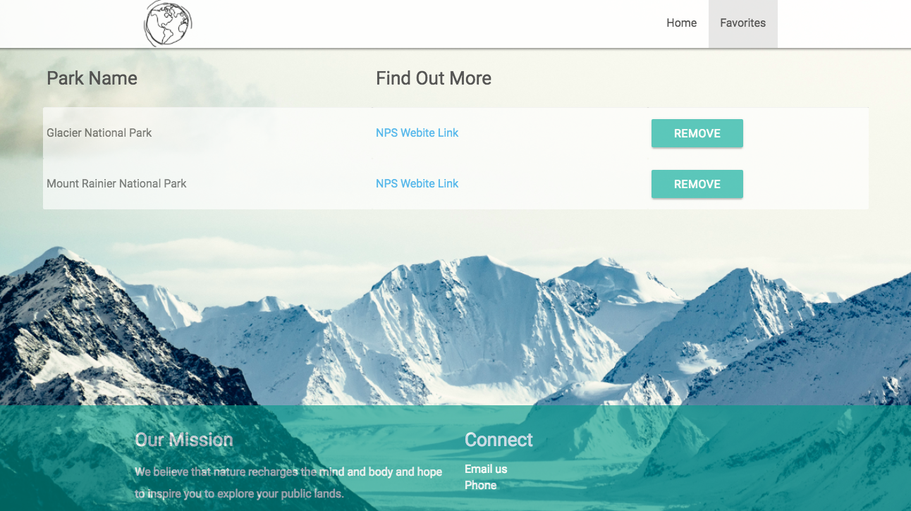

# National Park Finder

[National Park Finder](park-finder.surge.sh) allows users to explore National Parks within the US and add them to a 'favorites' list. To discover areas, the user can click on pins in the map to read about the area, link to the corresponding NPS website, or add the park to their favorites list.

User can browse around the interactive Google Map to find National Parks within the US. By clicking on a pin, the user can find out park information, view a a photo, and decide to add the park to their favorites.

User can view their favorite parks. To remove the park from their list, user can click the 'remove' button.

## Technologies

* Javascript
* jQuery
* HTML / CSS
* Materialize
* Mocha / Chai
* API's: National Park Service v1, Google Maps.
